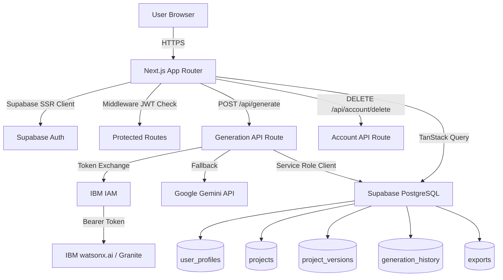

<div align="center">

# Aroko AI

**One Idea. Infinite Content.**

Transform a single creative idea into a complete AI-generated marketing content package — strategy, social media copy, SEO keywords, hashtags, and publishing recommendations — in minutes.

[](https://nextjs.org)
[](https://www.typescriptlang.org)
[](https://supabase.com)
[](https://www.ibm.com/watsonx)
[](https://tailwindcss.com)
[](./LICENSE)

> Submitted to the **IBM AI Builders Challenge** — Theme: *Reimagine Creative Industries with AI*

</div>

---

## Table of Contents

- [Overview](#overview)
- [Problem Statement](#problem-statement)
- [Solution](#solution)
- [Why Aroko AI?](#why-aroko-ai)
- [Features](#features)
- [Architecture](#architecture)
- [AI Workflow](#ai-workflow)
- [Tech Stack](#tech-stack)
- [Repository Structure](#repository-structure)
- [Getting Started](#getting-started)
- [Environment Variables](#environment-variables)
- [API Overview](#api-overview)
- [Authentication Flow](#authentication-flow)
- [Database Schema](#database-schema)
- [Screenshots](#screenshots)
- [Engineering Challenges](#engineering-challenges)
- [How IBM Bob Was Used](#how-ibm-bob-was-used)
- [Future Roadmap](#future-roadmap)
- [Contributors](#contributors)
- [Acknowledgements](#acknowledgements)

---

## Overview

Aroko AI is a full-stack web application built for the creative economy. It accepts a single natural-language description of an idea and produces a structured, ready-to-use marketing content package powered by large language models.

The app orchestrates IBM watsonx.ai (Granite) as its primary AI engine, with Google Gemini as an optional provider. When neither is configured, a deterministic mock layer keeps the full application functional for local development and demonstration purposes.

Users authenticate through Supabase, manage versioned content projects, and export their generated packages in PDF, Markdown, JSON, or plain text formats.

---

## Problem Statement

Creative professionals — independent creators, marketers, founders, and agencies — face a recurring bottleneck: translating a raw idea into a complete content strategy requires hours of work, multiple specialized tools, and consistent cross-channel messaging.

The typical workflow involves:

- Manual research into audience demographics and pain points
- Separate tools for copy, SEO, hashtag research, and scheduling
- Inconsistent brand voice across platforms
- No single deliverable that captures everything

This creates a productivity tax that scales poorly, is inaccessible to solo creators without agency budgets, and slows down the most time-sensitive campaigns.

---

## Solution

Aroko AI collapses the entire workflow into a single generation event.

The user provides:

1. A description of their idea
2. The relevant industry vertical
3. Their target audience
4. Their desired brand tone

The system constructs a structured prompt, sends it to the configured AI provider, validates the JSON response for schema completeness, persists a versioned record in the database, and renders the full content package in the browser.

The output covers: a creative brief, audience analysis, brand voice guidelines, marketing strategy, platform-specific social media copy (Instagram, LinkedIn, Twitter/X, Facebook), a call to action, hashtags, SEO keywords, and publishing recommendations.

Everything is exportable. Everything is version-tracked.

---

## Why Aroko AI?

Generic AI chat tools require the user to prompt-engineer their way to each individual output. Aroko AI is purpose-built for the creative content use case.

| Generic AI Chatbot | Aroko AI |
|---|---|
| One output per prompt | 12 structured outputs per generation |
| No persistence | Versioned project history |
| No export | PDF, Markdown, JSON, Text export |
| No user context | Project-scoped with industry and tone |
| Manual assembly | Single-action content package |

The difference is not the model. It is the workflow.

---

## Features

✅ **Email/Password Authentication** — Supabase Auth with JWT session management  
✅ **Auto Profile Provisioning** — Database trigger auto-creates user profiles on signup  
✅ **Project Dashboard** — View recent projects and quick-create from a hero input  
✅ **Project Management** — Create, duplicate, delete, and paginate projects  
✅ **AI Studio** — Guided generation interface with real-time phase progress  
✅ **Creative Brief Generation** — Comprehensive brief from a single idea  
✅ **Audience Analysis** — Deep audience profiling aligned to the idea  
✅ **Brand Voice Guidelines** — Tone-consistent messaging rules  
✅ **Marketing Strategy** — Multi-phase campaign strategy output  
✅ **Platform-Specific Copy** — Instagram, LinkedIn, Twitter/X, Facebook  
✅ **Call to Action** — Urgency-driven CTA per generation  
✅ **Hashtag Generation** — Contextual hashtags for discoverability  
✅ **SEO Keywords** — Searchability-optimized keyword set  
✅ **Publishing Recommendations** — Channel and timing guidance  
✅ **Version History** — Every generation is stored as a numbered version  
✅ **Generation History Tracking** — Per-user log of all generation events with token counts  
✅ **Export Toolkit** — PDF (via jsPDF), Markdown, JSON, and plain text  
✅ **Settings Panel** — Profile edit, avatar upload, password change, session management, notification preferences  
✅ **Account Deletion** — Full cascading delete via server-side API route  
✅ **Protected Routes** — Middleware-enforced route protection  
✅ **Responsive UI** — Mobile-first layout across all pages  
✅ **Dual AI Provider** — IBM watsonx.ai (Granite) primary, Google Gemini secondary, deterministic mock fallback  

---

## Architecture



**Key design decisions:**

- The generation API route uses the **service role client** to write to the database, but explicitly validates the user's JWT before doing so. This avoids RLS blocking server-side writes while preserving access control.
- All other database reads/writes from the client use the **anon key client** with RLS policies enforcing user isolation.
- User profile rows are created by a **PostgreSQL trigger** (`on_auth_user_created`) rather than a client-side insert. This is provider-agnostic and eliminates a class of race conditions.
- The IAM token for watsonx.ai is **cached in memory with a 30-second expiry buffer**, reducing authentication overhead across requests.

---

## AI Workflow

```
User Input
  │  idea, industry, targetAudience, tone
  ▼
Prompt Construction
  │  buildPrompt() assembles a structured instruction
  │  requesting a specific 12-key JSON schema
  ▼
Provider Selection
  │  GEMINI_API_KEY set?  → Gemini (responseMimeType: application/json)
  │  WATSONX_API_KEY set? → IBM Granite via watsonx.ai REST API
  │  Neither?             → Deterministic mock (no API call)
  ▼
Response Validation
  │  extractJson() finds the JSON object in the response
  │  Validates all 12 expected keys are present
  │  Throws on missing fields
  ▼
Database Persistence
  │  Increments version_number for the project
  │  Inserts into project_versions (content as JSONB)
  │  Inserts into generation_history (tokens, timing, status)
  ▼
Client Delivery
  │  API response includes content + metadata
  │  Client stores content in sessionStorage
  │  Redirects to /results for rendering
  ▼
Export (optional)
     PDF / Markdown / JSON / Text via lib/export/export-utils.ts
```

---

## Tech Stack

### Frontend

| Technology | Version | Purpose |
|---|---|---|
| Next.js | 16.2.6 | App Router, SSR, API Routes |
| React | 19 | UI rendering |
| TypeScript | 5.7.3 | Type safety |
| Tailwind CSS | 4.3.3 | Styling |
| Framer Motion | 12.42.2 | Animations and transitions |
| TanStack Query | 5.101.4 | Server state, caching, mutations |
| Lucide React | 1.16.0 | Icon system |
| Sonner | 2.0.7 | Toast notifications |

### AI & Backend

| Technology | Version | Purpose |
|---|---|---|
| IBM watsonx.ai | REST API | Primary AI provider (Granite models) |
| Google Gemini | REST API | Secondary AI provider |
| Next.js API Routes | — | Server-side generation and account management |
| jsPDF | 4.2.1 | PDF export |

### Auth & Data

| Technology | Version | Purpose |
|---|---|---|
| Supabase Auth | `@supabase/ssr` 0.12.3 | Authentication, session management |
| Supabase PostgreSQL | — | Persistent storage, RLS |
| `@supabase/supabase-js` | 2.110.9 | Client SDK |

### Developer Tools

| Tool | Purpose |
|---|---|
| IBM Bob | AI-assisted development (architecture, planning, implementation) |
| Vercel Analytics | Deployment analytics |
| ESLint | Linting |

---

## Repository Structure

```
aroko-ai/
├── app/                          # Next.js App Router
│   ├── api/
│   │   ├── generate/route.ts     # AI generation endpoint
│   │   └── account/delete/route.ts  # Account deletion endpoint
│   ├── dashboard/page.tsx        # User dashboard with recent projects
│   ├── studio/page.tsx           # AI generation interface
│   ├── projects/page.tsx         # Project management grid
│   ├── results/page.tsx          # Generated content display
│   ├── history/page.tsx          # Generation history browser
│   ├── exports/page.tsx          # Export management
│   ├── settings/page.tsx         # Account, notifications, security
│   ├── login/page.tsx            # Authentication
│   ├── signup/page.tsx           # Registration
│   ├── templates/page.tsx        # Templates browser
│   ├── help/page.tsx             # Help center
│   ├── page.tsx                  # Landing page
│   ├── layout.tsx                # Root layout with providers
│   └── globals.css               # Global styles
├── components/
│   ├── dashboard-layout.tsx      # Persistent sidebar + navigation
│   ├── create-project-modal.tsx  # New project form
│   ├── navbar.tsx                # Top navigation
│   ├── sidebar.tsx               # Side navigation
│   ├── protected-route.tsx       # Client-side auth guard
│   ├── providers.tsx             # TanStack Query + Auth providers
│   ├── error-boundary.tsx        # Error boundary wrapper
│   ├── loading-states.tsx        # Skeleton loading components
│   └── ui/                       # Base UI primitives
│       ├── button.tsx
│       ├── input.tsx
│       └── spinner.tsx
├── lib/
│   ├── ai/
│   │   └── generation-hooks.ts   # useGenerateContent, useProjectVersions, useGenerationHistory
│   ├── auth/
│   │   ├── auth-context.tsx      # AuthProvider, useAuth
│   │   └── auth-hooks.ts         # useLogin, useSignup, useUpdateProfile, useDeleteAccount, etc.
│   ├── export/
│   │   └── export-utils.ts       # exportToPDF, exportToMarkdown, exportToJSON, exportToText
│   ├── projects/
│   │   └── project-hooks.ts      # useProjects, useCreateProject, useDeleteProject, useSearchProjects
│   ├── supabase/
│   │   ├── client.ts             # Browser Supabase client
│   │   ├── server.ts             # Server-side / service role client
│   │   └── database.types.ts     # Generated TypeScript types
│   └── utils.ts                  # formatRelativeTime, projectStatusLabel, cn
├── supabase/
│   └── migrations/
│       ├── 001_create_core_tables.sql        # Core schema + RLS policies + indexes
│       ├── 002_auto_create_user_profile.sql  # Signup trigger + backfill
│       └── supabase/migrations/
│           └── 003_settings_support.sql      # Settings schema extensions
├── middleware.ts                 # Route protection (Next.js middleware)
├── next.config.mjs               # Next.js configuration
├── package.json                  # Dependencies
├── tsconfig.json                 # TypeScript configuration
├── postcss.config.mjs            # PostCSS / Tailwind configuration
└── .env.example                  # Environment variable template
```

---

## Getting Started

### Prerequisites

- Node.js 18 or later
- A [Supabase](https://supabase.com) project (free tier is sufficient)
- An IBM Cloud account with [watsonx.ai](https://www.ibm.com/watsonx) access, **or** a [Google Gemini](https://ai.google.dev) API key (both are optional — the app includes a mock fallback)

### 1. Clone the repository

```bash
git clone (https://github.com/Ahmedscreativeverse/Aroko-AI.git)
cd aroko-ai
```

### 2. Install dependencies

```bash
npm install
# or
pnpm install
```

### 3. Configure environment variables

```bash
cp .env.example .env.local
```

Edit `.env.local` with your credentials. See the [Environment Variables](#environment-variables) section for full details.

### 4. Apply database migrations

In your Supabase project dashboard, open the **SQL Editor** and run the migration files in order:

```
supabase/migrations/001_create_core_tables.sql
supabase/migrations/002_auto_create_user_profile.sql
```

### 5. Start the development server

```bash
npm run dev
```

The app runs at `http://localhost:3000`.

### 6. Build for production

```bash
npm run build
npm run start
```

---

## Environment Variables

### `.env.local`

```dotenv
# ──────────────────────────────────────────────
# Supabase (required)
# ──────────────────────────────────────────────

# Your Supabase project URL
NEXT_PUBLIC_SUPABASE_URL=https://your-project.supabase.co

# Supabase anonymous (public) key — safe to expose in the browser
NEXT_PUBLIC_SUPABASE_ANON_KEY=eyJ...

# Supabase service role key — server-side only, never expose to the client
# Used by the /api/generate and /api/account/delete routes
SUPABASE_SERVICE_ROLE_KEY=eyJ...

# ──────────────────────────────────────────────
# IBM watsonx.ai / Granite (optional)
# If unset, the app falls back to mock content.
# ──────────────────────────────────────────────

# Your IBM Cloud API key
WATSONX_API_KEY=

# Your watsonx.ai project ID
WATSONX_PROJECT_ID=

# watsonx.ai inference endpoint (defaults to us-south if unset)
WATSONX_URL=https://us-south.ml.cloud.ibm.com

# Model to use (defaults to ibm/granite-3-8b-instruct if unset)
WATSONX_MODEL_ID=ibm/granite-3-8b-instruct

# ──────────────────────────────────────────────
# Google Gemini (optional, takes priority over watsonx.ai if set)
# ──────────────────────────────────────────────

GEMINI_API_KEY=
GEMINI_MODEL=gemini-1.5-flash
```

**Provider priority:** `GEMINI_API_KEY` → `WATSONX_API_KEY` + `WATSONX_PROJECT_ID` → deterministic mock

---

## API Overview

All API routes are in [`app/api/`](app/api/) and run as Next.js serverless functions.

### `POST /api/generate`

Generates a full marketing content package for a project.

**Authentication:** `Authorization: Bearer <supabase_access_token>` (required)

**Request body:**

```json
{
  "projectId": "uuid",
  "idea": "A sustainable fashion e-commerce platform",
  "industry": "E-commerce",
  "targetAudience": "Eco-conscious millennials",
  "tone": "Inspirational"
}
```

**Response:**

```json
{
  "success": true,
  "versionId": "uuid",
  "versionNumber": 1,
  "content": {
    "creative_brief": "...",
    "audience_analysis": "...",
    "brand_voice": "...",
    "marketing_strategy": "...",
    "instagram_caption": "...",
    "linkedin_post": "...",
    "twitter_thread": "...",
    "facebook_post": "...",
    "call_to_action": "...",
    "hashtags": ["#tag1", "..."],
    "seo_keywords": ["keyword1", "..."],
    "publishing_recommendations": "..."
  },
  "metadata": {
    "tokens": 1842,
    "generationTimeMs": 4231
  }
}
```

The route validates the JWT, calls the AI provider, increments the version counter, and writes records to both `project_versions` and `generation_history`.

---

### `DELETE /api/account/delete`

Permanently deletes the authenticated user's account and all associated data (cascaded by the database foreign key constraints).

**Authentication:** `Authorization: Bearer <supabase_access_token>` (required)

**Response:**

```json
{ "success": true }
```

---

## Authentication Flow

Authentication is handled entirely by **Supabase Auth** using the `@supabase/ssr` package, which provides cookie-based session management compatible with Next.js Server Components and API Routes.

### Signup

1. User submits email, password, and full name at `/signup`
2. `supabase.auth.signUp()` creates a row in `auth.users`
3. The `on_auth_user_created` database trigger automatically creates a corresponding row in `public.user_profiles` (via `SECURITY DEFINER` function)
4. No client-side profile insert is required — this removes a class of RLS race conditions

### Login

1. User submits credentials at `/login`
2. `supabase.auth.signInWithPassword()` returns a session containing a JWT access token
3. The session is stored in cookies by the SSR client and refreshed automatically

### Route Protection

Route protection operates at two layers:

**Layer 1 — Next.js Middleware** ([`middleware.ts`](middleware.ts)):
- Runs on every request before the page renders
- Protected routes: `/studio`, `/projects`, `/results`, `/history`, `/settings`, `/exports`, `/templates`, `/help`, `/dashboard`
- Unauthenticated requests are redirected to `/login?redirectTo=<original path>`
- Authenticated users hitting `/login` or `/signup` are redirected to `/dashboard`

**Layer 2 — Client-side guards** (per-page `useEffect`):
- Each protected page checks `useAuth()` and imperatively redirects if `user` is null
- Handles edge cases where middleware may not catch a session expiry mid-session

### API Route Authorization

API routes use the **service role client** to bypass RLS for writes, but call `supabase.auth.getUser(accessToken)` to cryptographically verify the token before performing any operation. The verified `user.id` is used for all database operations — the client-supplied `projectId` is validated against the authenticated user's data.

### Session Management

- `AuthProvider` (React Context) wraps the application and subscribes to `onAuthStateChange`
- Session state is available throughout the component tree via `useAuth()`
- Password changes and "sign out all other sessions" are available in Settings

---

## Database Schema

Five tables, all with Row Level Security enabled.

```sql
user_profiles        -- Extended profile linked to auth.users (1:1)
  id uuid (PK, FK → auth.users)
  email, full_name, avatar_url
  plan text           -- 'free' | 'pro' | 'enterprise'
  notification_preferences jsonb
  created_at, updated_at

projects             -- User-owned content projects
  id uuid (PK)
  user_id uuid (FK → user_profiles, CASCADE DELETE)
  name, idea, industry, target_audience, tone, language
  status text         -- 'draft' | 'generating' | 'completed' | 'failed'
  created_at, updated_at

project_versions     -- Versioned AI output per project
  id uuid (PK)
  project_id uuid (FK → projects, CASCADE DELETE)
  version_number integer
  content jsonb       -- Full 12-key AI output
  generation_tokens integer
  generation_time_ms integer
  created_at

generation_history   -- Per-user audit log of all generation events
  id uuid (PK)
  user_id, project_id, version_id (all FK with CASCADE)
  tokens_used, generation_time_ms
  model_version text
  status text         -- 'completed' | 'failed' | 'pending'
  error_message text
  created_at

exports              -- Tracks export events per version
  id uuid (PK)
  user_id, version_id (FK)
  export_format text  -- 'pdf' | 'markdown' | 'json' | 'text'
  file_size_bytes integer
  created_at
```

**Indexes:** `user_id`, `project_id`, and `created_at` columns are indexed on all tables where they appear as frequent filter predicates.

**Trigger:** `on_auth_user_created` fires `AFTER INSERT ON auth.users` and calls `handle_new_user()` (SECURITY DEFINER) to provision the `user_profiles` row.

---

## Screenshots

> Screenshots and a demo video will be added to the repository after deployment.

| Page | Description |
|---|---|
| **Landing Page** | Hero section with AI pipeline visualization, feature cards, comparison section |
| **Dashboard** | Quick-create hero with prompt suggestions, recent projects grid |
| **Projects** | Full project grid with status badges, duplicate, delete actions, infinite scroll |
| **AI Studio** | Input form (idea, industry, audience, tone) with animated phase progress indicator |
| **Results** | Collapsible content cards per output type with copy, edit, and download actions |
| **History** | Searchable, filterable generation history timeline |
| **Exports** | Export archive with format, size, and timestamp metadata |
| **Settings** | Tabbed settings (Account / Notifications / Security) with avatar upload |

---

## Engineering Challenges

### 1. AI Response Schema Consistency

Language models do not reliably return clean JSON. The `extractJson()` function handles responses that embed JSON inside prose by scanning for the first `{` and last `}` characters. After extraction, all 12 expected keys are verified before the response is accepted. Malformed responses throw a structured error that propagates back to the client with a user-readable message.

### 2. Dual-Provider Architecture

Supporting both IBM watsonx.ai (which requires a two-step IAM token exchange) and Google Gemini (which returns `application/json` natively) without diverging the prompt or validation logic required careful provider abstraction. Both providers share `buildPrompt()` and `extractJson()`. The selection logic is environment-variable-driven and tested with zero config via the mock fallback.

### 3. IBM IAM Token Caching

The watsonx.ai REST API requires a Bearer token obtained from `iam.cloud.ibm.com`. Fetching a new token per request would add ~300–500ms of latency. The implementation caches the token in a module-level variable with an expiry check, refreshing 30 seconds before it expires.

### 4. RLS and Server-Side Writes

Supabase RLS policies only trust `auth.uid()` derived from the session cookie, which is not available in server-side API routes using the service role key. The solution is explicit JWT verification via `supabase.auth.getUser(accessToken)` before any write, using the verified `user.id` for all subsequent queries.

### 5. User Profile Provisioning

An early version required a client-side `INSERT INTO user_profiles` on signup. This failed silently for users who signed up before the INSERT RLS policy existed. Migration `002_auto_create_user_profile.sql` replaced this with a `SECURITY DEFINER` trigger, making profile creation provider-agnostic and immune to client-side RLS constraints.

### 6. Infinite Scroll and Cursor Pagination

The projects list uses TanStack Query's `useInfiniteQuery` with page-based cursor pagination. The query key includes `userId` to ensure cache isolation between users, and `invalidateQueries` is called on create/delete to keep the list consistent.

---

## How IBM Bob Was Used

IBM Bob — the AI development assistant embedded in the development environment — contributed meaningfully across the full development lifecycle of this project.

**Architecture & Planning**
Bob was consulted to evaluate the trade-offs between different authentication patterns (middleware-only vs. middleware + client-side guards), the decision to use a database trigger for profile provisioning, and the provider abstraction strategy for supporting multiple AI backends.

**Frontend Development**
Bob assisted with implementing TanStack Query's `useInfiniteQuery` pattern for project pagination, the `AnimatePresence` / phase-based generation progress UI in the AI Studio, and the collapsible card layout on the Results page.

**Backend / API Routes**
Bob was used to reason through the correct approach for JWT verification in service-role API routes — specifically the pattern of calling `supabase.auth.getUser(accessToken)` rather than trusting a client-supplied user ID. Bob also helped structure the watsonx.ai IAM token caching logic.

**Database Design**
Bob contributed to schema review, specifically identifying the missing INSERT RLS policy on `user_profiles` and recommending the `SECURITY DEFINER` trigger approach as the more robust fix.

**Export Utilities**
Bob scaffolded the `export-utils.ts` module covering all four export formats, including the PDF layout with pagination and word wrapping via jsPDF.

**Debugging**
Bob was used to diagnose silent failures during account creation (the RLS INSERT gap) and to trace the root cause of `project_versions` inserts failing when no user profile row existed.

**Documentation**
This README was written with Bob's assistance through the IBM AI Builders Challenge IBM Bob integration, using a product-owner-level specification to ensure every section accurately reflects the current codebase.

---

## Future Roadmap

| Priority | Feature |
|---|---|
| High | Live database-backed Generation History page (replace static mock) |
| High | Real export tracking persisted to the `exports` table |
| High | Templates gallery with pre-built industry briefs |
| Medium | Inline content editing on the Results page |
| Medium | Per-section regeneration without triggering a full generation |
| Medium | Two-factor authentication (UI placeholder already present) |
| Medium | Share links for generated content packages |
| Low | Team/workspace support with shared projects |
| Low | Webhook notifications for async long-running generations |
| Low | Public API for programmatic content generation |

---

## Contributors

| Contributor | Role |
|---|---|
| **Project Team** | Architecture, Frontend, Backend, AI Integration, Design |
| **IBM Bob** | Development assistant — architecture, implementation, debugging, documentation |

---

## License

This project is licensed under the [MIT License](./LICENSE).

---

## Acknowledgements

- **[IBM](https://www.ibm.com)** — IBM AI Builders Challenge, watsonx.ai platform, Granite models
- **[IBM Bob](https://www.ibm.com)** — AI development assistant used throughout this project
- **[Supabase](https://supabase.com)** — Authentication, database, and storage infrastructure
- **[Next.js](https://nextjs.org)** — Application framework
- **[TanStack Query](https://tanstack.com/query)** — Server state management
- **[Framer Motion](https://www.framer.com/motion/)** — Animation library
- **[Tailwind CSS](https://tailwindcss.com)** — Utility-first CSS framework
- **[Lucide](https://lucide.dev)** — Icon system
- **[jsPDF](https://github.com/parallax/jsPDF)** — Client-side PDF generation
- **Open Source Community** — For the ecosystem that made this possible

---

<div align="center">
  <sub>Built for the IBM AI Builders Challenge · Reimagine Creative Industries with AI</sub>
</div>
